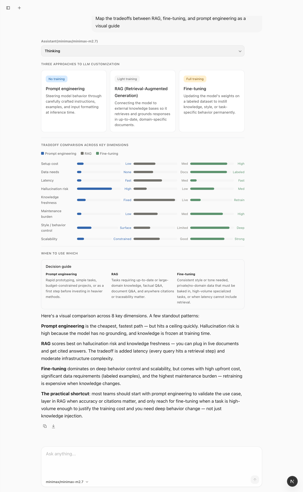
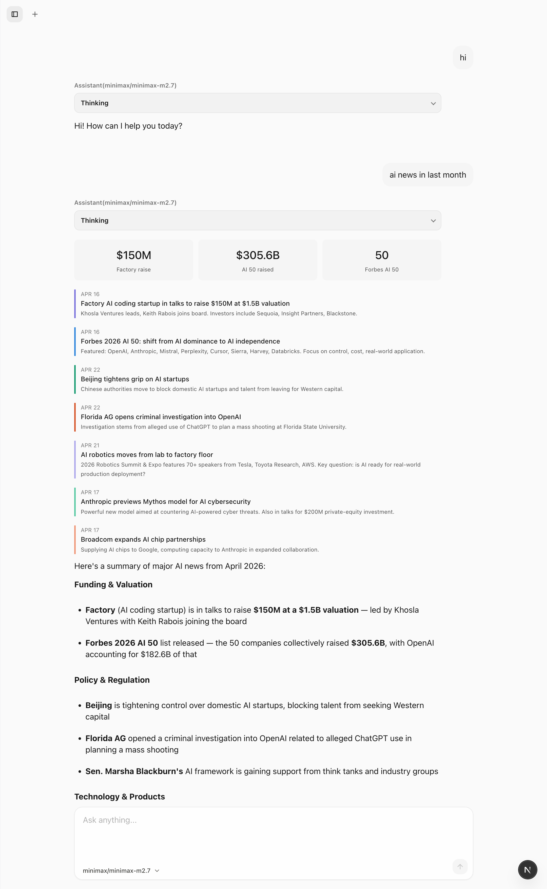
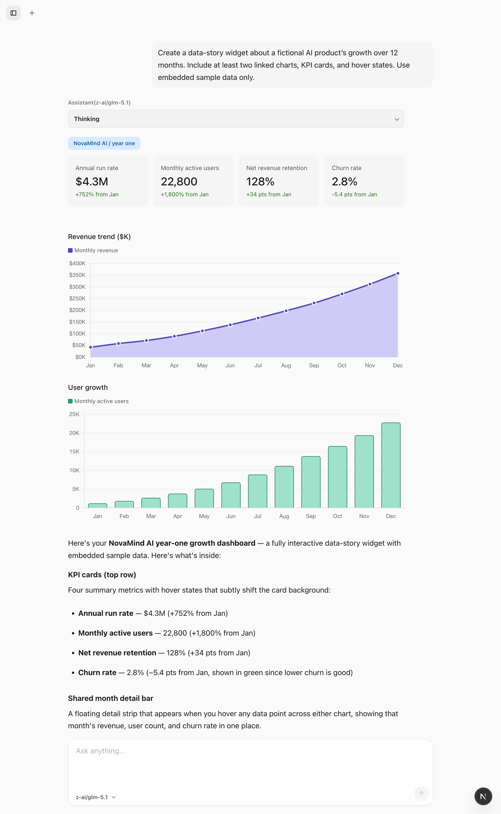
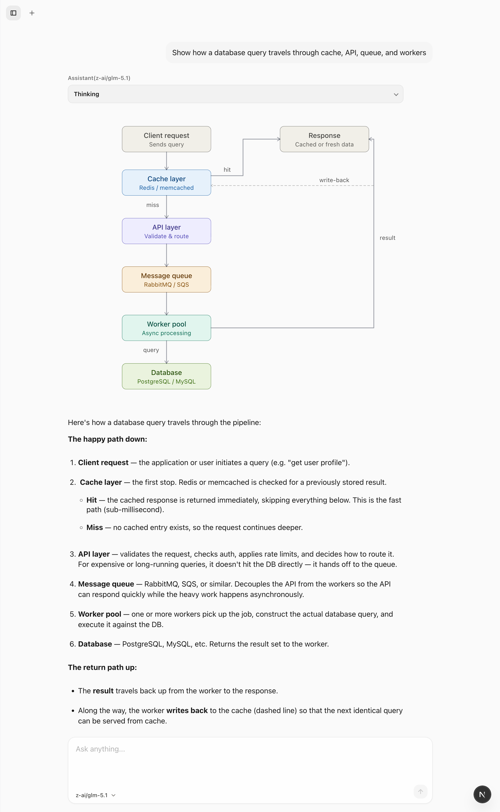
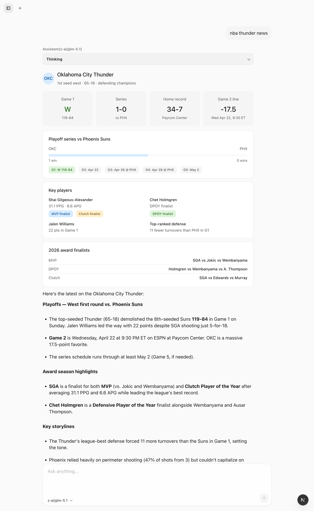
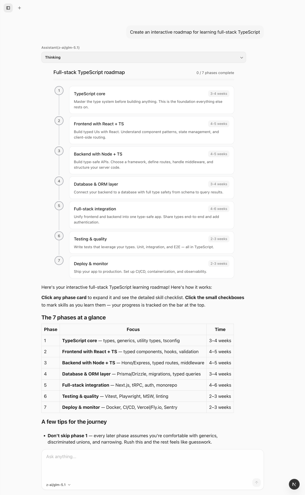

# Open Claude Gen UI

Open Claude Gen UI is a Next.js app for building AI chat experiences that do more than stream text. It supports multi-provider chat, trusted generative UI widgets, live tool use, and a showcase flow that turns saved conversations into read-only public demos.

## What It Does

- Runs a single chat surface across Volcengine ACK, Volcengine Coding, OpenAI, MiniMax, DeepSeek, OpenRouter, Anthropic, and Google Gemini.
- Lets the agent call tools such as Tavily web search and render rich inline widgets when trusted generative UI is enabled.
- Stores provider credentials, model visibility preferences, Tavily settings, and chat traces locally so the app survives reloads without extra setup.
- Exports curated chats into repo-tracked JSON for public read-only demos while preserving the full chat shell layout.
- Works as both a local experimentation app and a Vercel-friendly showcase deployment.

## Example Gallery

### RAG Tradeoffs



Comparison of prompt engineering, RAG, and fine-tuning as a visual decision aid.

### AI News



A news-style layout that mixes KPI cards, a timeline, and supporting written analysis.

### Chart



A growth dashboard with KPI cards and linked charts rendered inline in the conversation.

### SVG Flow



A system diagram showing how a database query moves through cache, API, queue, and workers.

### NBA



A compact sports dashboard for a team update, series state, key players, and storylines.

### Roadmap



An interactive learning roadmap preserved as a read-only chat example.

## Quick Start

Install dependencies and create a local env file:

```sh
corepack prepare pnpm@10.32.1 --activate
pnpm install
cp .env.example .env.local
```

Start the app:

```sh
pnpm dev
```

Open <http://localhost:3000>.

You can add provider API keys in `.env.local`, or save them from the UI with `Connect provider`. Frontend-saved keys are encrypted and stored server-side in `.data/providers/`.

## Static Showcase Mode

The repository includes a read-only example flow based on the six conversations above.

Export the curated examples from local chat storage:

```sh
pnpm export:examples
pnpm build
```

This snapshots selected chats from `.data/chats/` into `lib/example-chats/data/`. The `/examples` and `/examples/[slug]` routes still render those snapshots directly, and showcase mode also uses the same exported data to power the normal `/chat/:id` shell without needing local chat storage.

For a public demo deployment, set:

```sh
SHOWCASE_ONLY=true
```

When enabled, the app serves the curated example chats through the normal `/chat/[id]` interface, redirects `/` and unknown chat ids to the default example, keeps the sidebar and composer chrome intact, and blocks write actions such as sending messages or renaming chats.

## Configuration Highlights

- `VOLCENGINE_ACK_API_KEY`, `VOLCENGINE_CODING_API_KEY`, `OPENAI_API_KEY`, `MINIMAX_API_KEY`, `DEEPSEEK_API_KEY`, `OPENROUTER_API_KEY`, `ANTHROPIC_API_KEY`, `GOOGLE_GENERATIVE_AI_API_KEY`: provider credentials.
- `TAVILY_API_KEY`: enables live web search for the agent.
- `NEXT_PUBLIC_GENERATIVE_UI_TRUSTED=true`: enables trusted widget rendering by default unless overridden in Settings.
- `LANGSMITH_TRACING=true` plus `LANGSMITH_API_KEY`: enables LangSmith tracing for model calls, tool calls, and agent steps.
- `PROVIDER_CREDENTIALS_MASTER_KEY`: optional override for local encryption of frontend-saved credentials.

The Volcengine ACK provider also accepts `VOLCENGINE_ARK_*` aliases, including `VOLCENGINE_ARK_CODING_*` for the coding endpoint.

## Development Commands

```sh
pnpm dev
pnpm check
pnpm build
pnpm export:examples
make ci
```

## Repo Guide

- [docs/ARCHITECTURE.md](docs/ARCHITECTURE.md): runtime topology, package boundaries, and showcase flow.
- [docs/FRONTEND.md](docs/FRONTEND.md): chat UI and frontend conventions.
- [docs/REPO_COLLAB_GUIDE.md](docs/REPO_COLLAB_GUIDE.md): repository-wide working rules.
- [docs/QUALITY_SCORE.md](docs/QUALITY_SCORE.md): current quality targets and gaps.
- [docs/histories/](docs/histories): change history for finished tasks.

## License

[MIT](LICENSE)
