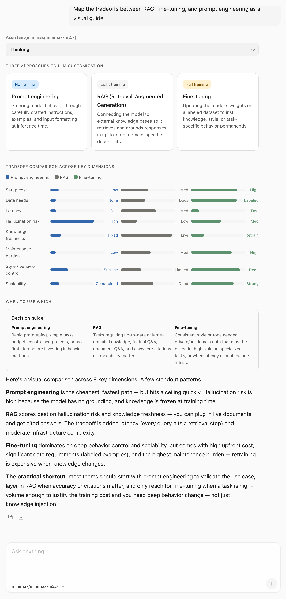
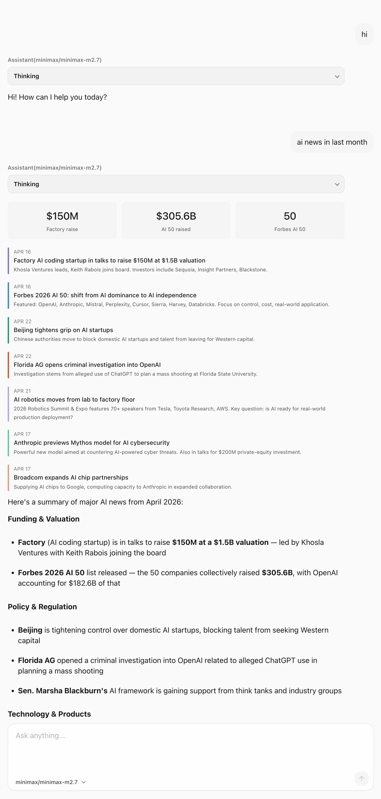
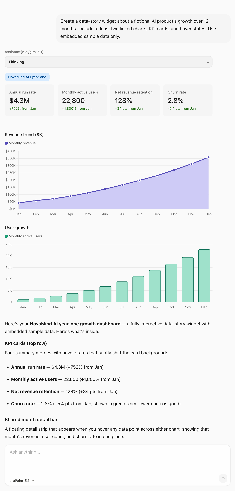
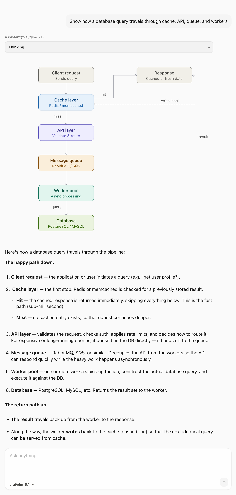
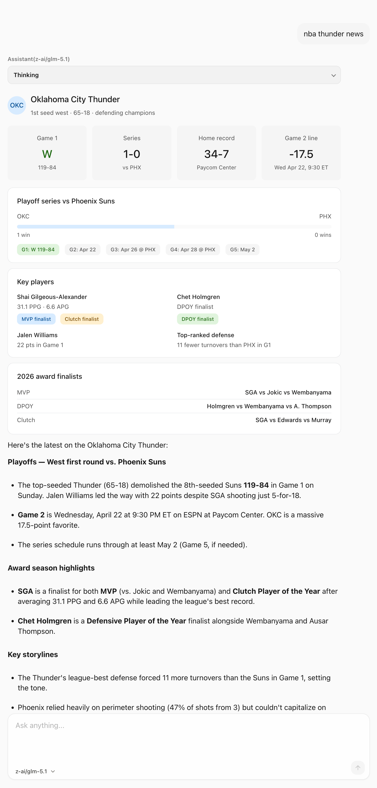
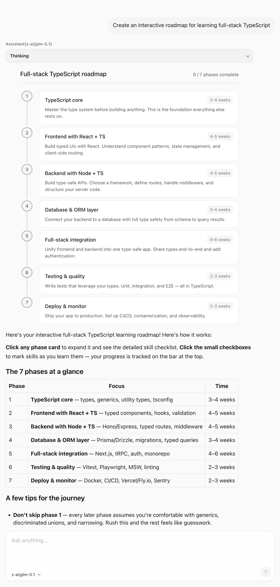

# Open Claude Gen UI

This project started from Claude's visual response direction: [Claude now creates interactive charts, diagrams and visualizations](https://claude.com/blog/claude-builds-visuals).

demo:
https://github.com/user-attachments/assets/9d42f827-fe32-49c0-bb97-b4d58e52f260

<table>
  <tr>
    <td>
      
       
      Comparison of prompt engineering, RAG, and fine-tuning as a visual decision aid.
    </td>
    <td>
      
       
      A news-style layout that mixes KPI cards, a timeline, and supporting written analysis.
    </td>
    <td>
      
       
      A growth dashboard with KPI cards and linked charts rendered inline in the conversation.
    </td>
  </tr>
  <tr>
    <td>
      
       
      A system diagram showing how a database query moves through cache, API, queue, and workers.
    </td>
    <td>
      
       
      A compact sports dashboard for a team update, series state, key players, and storylines.
    </td>
    <td>
      
       
      An interactive learning roadmap preserved as a read-only chat example.
    </td>
  </tr>
</table>

## References

- https://github.com/Michaelliv/pi-generative-ui
- https://michaellivs.com/blog/reverse-engineering-claude-generative-ui/
- https://github.com/op7418/CodePilot
- https://github.com/op7418/Generative-UI-MCP
